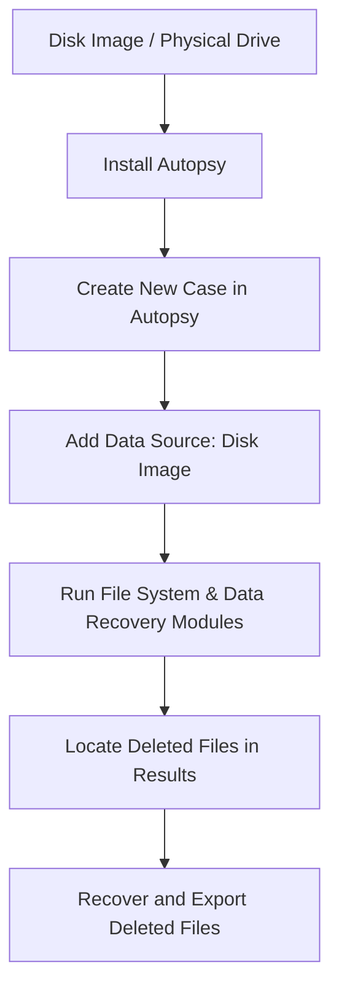

# FILE-RECOVERY-USING-AUTOPSY-SOFTWARE

## AIM
To use **Autopsy Digital Forensics Tool** to retrieve deleted files from a disk image.

---

## REQUIREMENTS
- **Operating System**: Windows 10/11, macOS, or Linux
- **Tool**: [Autopsy Digital Forensics](https://www.autopsy.com/)  
- **Test Data**: Disk image file (`disk.dd`, `disk.img`, `.E01`)

---

## ARCHITECTURE DIAGRAM

## DESIGN STEPS:
### Step 1:
Open Autopsy and create a new case with appropriate case details.

### Step 2:
Add a disk image as a data source and let Autopsy analyze the content.

### Step 3:
Navigate to the "Deleted Files" section in Autopsy and examine or recover the deleted files.

## PROGRAM:

STEP 1 :  CREATING A NEW DISK  (DISK 1)
•	Go to the start menu of your desktop and open Disk Management. Create a partition of your already available Local Drive. 
                  
 

•	For creating a new disk, create a new unallocated space in the already available Disk 0. And then assign a drive letter to it and create a drive G: as shown. This drive has 2 GB capacity.

•	Now go to Action tab and choose Create VHD

•	Now choose the location where you want to store your VHD and assign it a name. Then choose the other specifications as shown and click OK.

•	Now the new Disk (Disk 1) is created. Now right click on the unallocated space in Disk 1.

• Choose New Simple Volume

•	A wizard opens

•	Click next -> Then in this page choose any letter for your drive.

•	Click Next then Finish

STEP 2:  ADDING FILES INSIDE THE NEWLY CREATED DRIVE

•	In your PC you can view the new drive created

•	Inside it, add some image files as shown.

•	Then, delete some files 

STEP 3: CREATING A DISK IMAGE USING FTK IMAGER

•	Open FTK Imager and go to File tab and choose Create Disk Image

•	Select the Source type as Physical Drive

•	Choose the Virtual Disk (Disk 1)

•	Choose the Add option

•	Choose the image type as .E01

•	Choose the image destination and give start.

STEP 4: VIEW THE DELETED FILES USING AUTOPSY TOOL

•	Go to your start menu and open Autopsy as an Administrator.

•	Select the New Case option when the dialog box opens.

•	Type the necessary details as shown. In the base directory choose the directory where you want to store the details of this case and where you want the recovered data to be stored. Preferably, choose the same drive from where you deleted the files. Then click on Next.

•	Fill in necessary details and click Finish.

•	The Case will be created. Such a window will be visible.

•	Now that the case has been created choose the Add Data Source option under the File tab. Select the Host as shown and click Next.

•	Under Select  Data  Source Type, choose Disk Image or VM File and click Next

•	Now under Select Data Source choose the disk image from which data has to be recovered.

•	Click Finish and then the following screen will be displayed. In this screen to see whatever was deleted from this drive, click the Deleted  Files option from the left pane as shown.

•	On clicking the Deleted Files option, such a screen will be visible

STEP 5:   RECOVERING THE DELETED FILES

•	Select the files that you want to recover and right – click on them. Select the Extract File (s) option.

•	Now to view the recovered files, go to that drive and click on the Case folder created inside this drive.

•	Inside that folder, go to the Export Folder.

•	Inside that folder you can find your recovered files

## RESULT:
Deleted files were successfully retrieved and analyzed using Autopsy.
